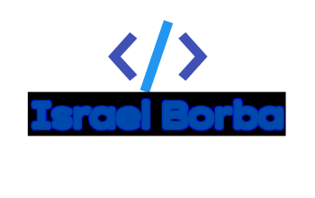

<!-- Header Section -->

Welcome to my GitHub profile! Here's a little about me:

- 🔭 I’m currently working on **a Blockchain project made in Go**
- 🌱 I’m learning **Golang and Solidity**

 

## 🛠 Main stacks

| Stack   |      Since      |
|----------|:--------------:|
|  | 2017 |
|  | 2021|
|  | 2022 |
|  | 2024 |

## 📫 Contact Me

&nbsp;&nbsp;

## 📫 Skills

